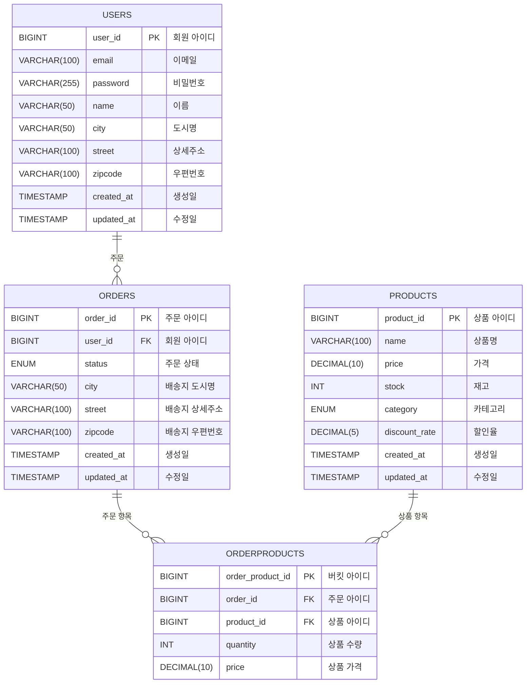

# 🛍️ For Us Market

- **요약**: 대용량 Dummy 데이터를 처리할 수 있는 대형 쇼핑몰 백엔드 API 개발
- **핵심 목표**: 사용자에게 **안전한 보안 정책**, **고속 데이터 조회**, **정확한 거래 처리**를 제공
- **진행 기간**: 2025.09.24 ~ 2025.10.01

---

## 목차

1. [🛠️ 기술 스택](##🛠️-기술-스택)
2. [🔗 ERD](##🔗-ERD)
3. [**📋** 주요 기능](##**📋**-주요-기능)
4. [🎯 성능 개선 & 트러블 슈팅](##🎯-성능-개선-&-트러블-슈팅)
5. [📄 API 명세서](##📄-API-명세서)
6. [👥 팀원](##👥-팀원)

---

## 🛠️ 기술 스택

### Back

&nbsp;
&nbsp;
&nbsp;
&nbsp;
&nbsp;

### Tool

&nbsp;
&nbsp;

## 🔗 ERD

## **📋** 주요 기능

### 1. 사용자 관리

- 로그인 / JWT 인증
- 유저 프로필 조회

### 2. 상품

- 상품 등록 / 조회 API
- 카테고리 구체화
- 대량 상품 데이터 처리

### 3. 주문

- 주문 생성 / 취소
- 주문 상태 관리
- 트랜잭션 기반 재고 검증 및 차감 (락 적용)

### 4. 주문 로그

- 주문 로그 AOP 수집
- 사용자 주문 로그 수집 및 조회

### 5. 검색 및 집계

- 상품 검색 API
- 인기 검색어 집계

## 🎯 성능 개선 & 트러블 슈팅

📌Access & Refresh 인증 관리

    - Spring Security + JWT 기반 로그인/인증 시스템 
    - Redis 캐시 서버를 활용한 Refresh Token 저장 및 블랙리스트 관리 
    - Refresh Token 로테이션 전략 적용으로 토큰 재사용 방지 
    - HttpOnly 쿠키 적용으로 XSS 기반 토큰 탈취 위험 최소화 

📌 단계별 쿼리 개선

### **실험 환경**

- 500만 건 상품 데이터, 페이지 크기(size) 60
- OFFSET: 0 (처음), 90,000 (중간), 208,200 (끝)

### **비교 대상**

- 단순 Offset 기반 페이징
- **복합 인덱스** (`subcategory, updated_at, id`)
- **커버링 인덱스** (`subcategory, updated_at, id` + SELECT 컬럼 포함)
- **No-Offset 방식**

### **성능 결과: Offset vs No-Offset**

- Offset 방식

| 페이지 위치        | OFFSET  | 인덱스 없음 | 복합 인덱스 | 커버링 인덱스 |
|---------------|---------|--------|--------|---------|
| **Page 0**    | 0       | 7.05s  | 83ms   | 81ms    |
| **Page 1500** | 90,000  | 7.65s  | 17.96s | 118ms   |
| **Page 3470** | 208,200 | 7.47s  | 42.69s | 155ms   |

-
    - No-Offset 방식

| 페이지 위치        | OFFSET  | 조회 범위 (rows)  | 인덱스 없음 | 복합 인덱스 *(Extra: Using index condition)* |
|---------------|---------|---------------|--------|-----------------------------------------|
| **Page 0**    | 0       | 처음부터 60개      | 4.35s  | 9ms                                     |
| **Page 1500** | 90,000  | 90,000 + 60개  | 4.27s  | 12ms                                    |
| **Page 3470** | 208,200 | 208,200 + 60개 | 4.25s  | 10ms                                    |

📌 로그 기록 조회 성능 개선 (캐시 적용 전/후)

### **개선 전**

- 동일 유저 로그 반복 조회할 때 매번 DB에서 SELECT 발생
- 조회량이 많아지면 DB에 과부하
- 초기 로그 조회 속도: 337ms

### 개선 과정

- 캐시 적용 (Redis)
- 337ms → 19ms → 14ms

### 개선 내용

- Spring Cache + Redis 적용 (@Cacheable)
- 반복 조회 시 DB 쿼리 발생 없이 Redis에서 즉시 응답

### ⏳ 캐시 적용 전 337m

### ⏳ 캐시 적용 후 19ms

### 성능 비교

|       | 캐시 적용 전          | 캐시 적용 후                     |
|-------|------------------|-----------------------------|
| 응답 시간 | 337ms            | 19ms                        |
| DB 조회 | 동일 요청 시 쿼리 반복 발생 | 첫 요청만 쿼리가 발생하고, 이후 Redis 조회 |
| 차이점   | 부하 상황에서 병목 발생    | 요청 많을수록 캐치 히트율 ↑            |

📌 검색 API

저희는 조회 성능을 높이기 위해 주문 로그와 상품 검색 로직에 캐싱을 적용했습니다.

주문 로그 조회와 상품 검색에서 매번 DB에 SELECT 쿼리가 발생해 응답 속도가 느려지는 부분이 있었고, 이를 개선하기 위해 Redis 캐시를 적용해 반복적인 쿼리 발생을 줄이고 응답 속도를 개선했습니다.

Spring Cache의 @Cacheable을 적용해서, 처음 요청은 DB에서 가져오지만, 이후 동일 요청은 Redis에서 바로 응답하도록 구조를 바꿨습니다.

| 데이터 개수 | 캐시 적용 전 | 캐시 적용 후 시간 변동        |
|-------------|--------------|------------------------------|
| 100만 건    |              | 617ms → 35ms → 11ms          |
| 300만 건    | 1.89s        | 1.90s → 12ms                 |
| 500만 건    | 4.06s        | 3.09s → 20ms → 11ms          |

### **캐시 적용 시 발생한 이슈**

- **일반 DTO vs record 클래스**
→ 기본 생성자가 없으면 Jackson이 객체를 만들 수 없음
     Record는 컴파일 시 모든 필드를 받는 생성자를 자동으로 만들어줌
     but, dto는 없을 수 있으므로 `NoArgsConstructor` 또는 `@JsonCreator`가 필요함
    - @NoArgsConstructor를 추가해 해결
- **pageImpl 기본 생성자 이슈**
→ Jackson이 `PageImpl` 생성자를 모름, 역직렬화 실패
     `PageImpl`을 만들려면 기본 생성자 + 세터 또는 @JsonCreator 생성자가 필요함
    - @JsonCreator를 통해 해결
    
- **LocalDateTime 직렬화**
→ Java 8 날짜/시간(LocalDateTime 등)**는 기본 ObjectMapper에 등록되어 있지 않음
    - objectMapper에 LocalDateTime 설정 추가로 해결 (but, 타입 에러 발생)
    
- **objectMapper 이슈**
→ ObjectMapper는 기본적으로 직렬화/역직렬화 시 class type 정보를 포함하지 않음
    그러므로 직렬화된 데이터에는 type 정보가 존재하지 않는다.
    - @JsonSerialize, @JsonDeserialize로 해결

📌 인기 검색어 Write Back
 

### 스케줄러(Scheduler)란?

- **특정 작업(Task)을 정해진 시간/주기마다 자동으로 실행**하도록 예약하는 기능입니다.
- 사람이 직접 실행하지 않아도 **자동으로 반복 수행** 가능.
- 흔히 “크론(Cron) 기반” 방식이나 fixed delay/interval 방식으로 사용합니다.

스케줄러 적용해 server에서 받은 상품 조회 기록들을 redis 캐시에 저장해뒀다가 (cron = “0 */5 * * * *”) 방식을 통해
5분마다 자동으로 DB에 적용하도록 구현하였습니다.
이를 통해, 조회 횟수를 redis에서 카운팅 할 뿐만 아니라 DB에 영구적으로 저장해 원자성과 신뢰성을 보장할 수 있었습니다.

📌 동시성 제어

### 동시성 제어 적용 시나리오

- 주문 시 상품 재고 감소에 대한 동시성 처리

### Lettuce 구현 시 고려한 것

- **Lock 획득에 실패했을 때 어떻게 할 것인가**
    - spin lock을 구현했고 최대 3회 재시도 후 예외처리
- **Redis 를 이용해 Lock 을 구현한 이유는 무엇일까**
    - 비관 락에 비해 속도는 느리지만 커넥션 풀로 누수로 인해 발생하는 DB 부하를 줄일 수 있음
- **Redis 에서 Lock 을 걸때 Key 로 어떤 값을 사용했고, 왜 해당 Key 를 이용해 Lock 을 만들었을까?**
    - 상품 키, 상품 재고에 대한 무결성이 보장돼어야 해서

### Lettuc 구현시 발생한 이슈

- 트랜잭션 종료 후 영속성을 DB에 저장하기 전에 락이 해제될 수 있습니다.
    - 트랜잭션 종료와 락 해제 시점 불일치 문제 → `afterCommit()`으로 해결
- 트랜잭션 어노테이션과 커스텀 락 어노테이션의 순서를 정해줘야합니다.
    - 클래스를 분리해 해결
- 멀티 스레드 환경에서 락을 풀 때 스레드를 구분하지 않으면 정합성 문제가 생길 수 있습니다.
- 스핀락 사용 시 타임아웃시간을 짧게 설정하면 락 획득에 실패하는 케이스가 늘어날 수 있습니다.

### **성능 비교 (테스트: 동시 요청 50건, 재고 100개)**

| 방식                | 처리 시간     | 성공률      | 비고                           |
|-------------------|-----------|----------|------------------------------|
| 비관적 락             | ~3.2s     | 100%     | 커넥션 풀 10 초과 시 **Timeout** 발생 |
| 낙관적 락             | ~2.8s     | 60%      | 충돌 발생 시 대부분 롤백               |
| Lettuce (스핀락)     | ~2.5s     | 100%     | Redis CPU 부하 ↑               |
| **Redisson (최종)** | **~1.9s** | **100%** | 안정적 처리, 부하 ↓                 |

### 최종 선택

- **Redisson 분산락**
    - 정합성 보장, 성능 안정성 확보
    - Lettuce 직접 구현 대비 단순하고 운영이 용이
    - DB 락 대비 부하 감소

### 동시성 테스트 속도 비교

## 📄 API 명세서

### 1. 사용자 API

| Method | URI                      | Request                               | Description |
|--------|--------------------------|---------------------------------------|-------------|
| POST   | `/api/v1/auth/signup`    | `name`, `email`, `password`           | 회원가입        |
| POST   | `/api/v1/auth/login`     | `email`, `password`                   | 로그인         |
| POST   | `/api/v1/auth/reissue`   | `refreshToken`                        | 토큰 재발행      |
| POST   | `/api/v1/auth/logout`    | `authorizationHeader`, `refreshToken` | 로그아웃        |
| DELETE | `/api/v1/auth/withdraw`  | `userId`, `password`, `refreshToken`  | 회원탈퇴        |
| GET    | `/api/v1/users/{userId}` | `userId`                              | 사용자 프로필 조회  |

### 2. 상품 API

| Method | URI                            | Request                                                                          | Description |
|--------|--------------------------------|----------------------------------------------------------------------------------|-------------|
| POST   | `/api/v1/products`             | `name`, `price`, `stock`, `discountRate`, `category`, `subCategory`              | 상품 등록       |
| GET    | `/api/v1/products`             | `page`, `size`, `sort`                                                           | 상품 목록 조회    |
| GET    | `/api/v1/products/{productId}` | `productId`                                                                      | 상품 단일 조회    |
| PUT    | `/api/v1/products/{productId}` | `productId`, `name`, `price`, `stock`, `discountRate`, `category`, `subCategory` | 상품 수정       |
| GET    | `/api/v1/products/search`      | `name`, `SubCategoryType`, `page`, `size`                                        | 상품 검색       |
| GET    | `/api/v2/products/search`      | `name`, `SubCategoryType`, `page`, `size`                                        | 상품 검색 (캐싱)  |

---

### 3. 주문 API

| Method | URI                          | Request                                                | Description |
|--------|------------------------------|--------------------------------------------------------|-------------|
| POST   | `/api/v1/orders`             | `userId`, `productIds`, `quantity`, `price`, `address` | 주문 생성       |
| DELETE | `/api/v1/orders/{orderId}`   | `orderId`                                              | 주문 취소       |
| GET    | `/api/v1/orders`             | `page`, `size`                                         | 주문 목록 조회    |
| GET    | `/api/v1/orders/{orderId}`   | `orderId`                                              | 주문 단일 조회    |
| GET    | `/api/v1/orderlogs/{userId}` | `userId`, `page`, `size`                               | 주문 로그 조회    |

---

### 4. 인기검색 API

| Method | URI                  | Request | Description |
|--------|----------------------|---------|-------------|
| GET    | `/api/v1/hotkeyword` |         | 인기 검색어 조회   |

## 👥 팀원

김기수 - [GitHub](https://github.com/Lunarltn)

원세영 - [GitHub](https://github.com/seyoung5744)

이은진 - [GitHub](https://github.com/eunjin0468)

이호용 – [GitHub](https://github.com/nyong0313)

정은서 - [GitHub](https://github.com/eunseo04)
